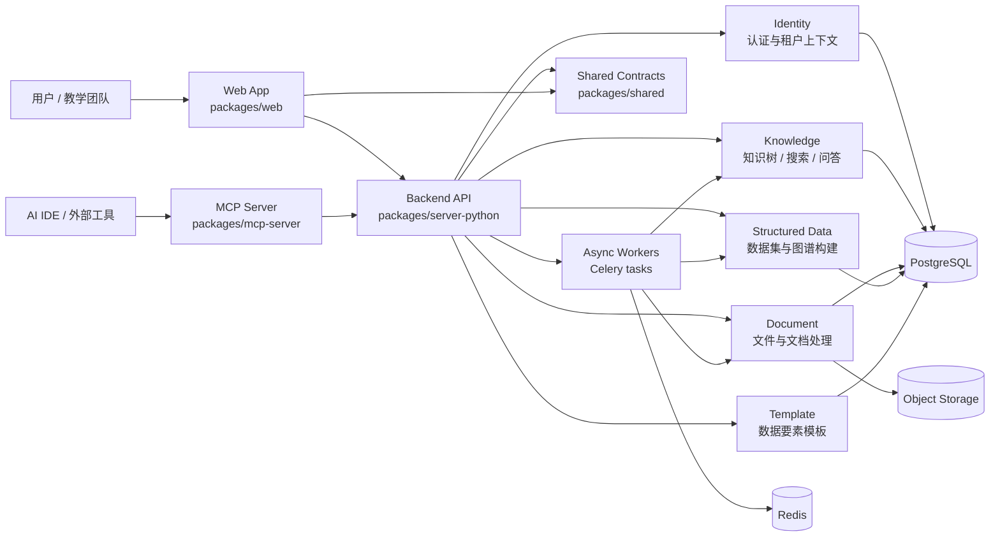

# MetaEduBase Architecture

本文档是 MetaEduBase 的长期架构地图。

它回答的是这些问题：

- 这个系统由哪些核心部分组成
- 每个部分各自负责什么
- 关键业务流如何穿过系统
- 哪些约束在长期内必须保持稳定

它不承担 API 清单、数据库字段 inventory、测试数量或一次性运行说明。这些高频变化信息应回到代码、专项规则或任务文档。

## 1. 系统定位

MetaEduBase 是面向职业教育场景的 AI Native 知识基座。它把知识管理、文档处理、结构化数据处理和 AI 问答放在同一个多租户系统里，目标是让学校或教学团队能够围绕同一套知识资产持续沉淀、检索、加工和复用。

系统不是单一聊天应用，也不是单纯的文件管理器。它更接近一个围绕“知识资产生命周期”搭建的平台：

1. 采集知识资产：文件、数据集、模板
2. 处理知识资产：解析、分块、抽取、索引、图谱构建
3. 组织知识资产：知识树、知识图谱、模板语义
4. 消费知识资产：搜索、问答、管理和复用

## 2. 架构原则

### 2.1 领域优先，而不是按技术堆功能

后端以 bounded context 组织，避免把所有能力堆进一个“通用服务层”。知识、文档、结构化数据、模板和身份认证各自拥有清晰职责。

### 2.2 多租户是默认约束

租户隔离不是外围特性，而是核心架构假设。新的数据访问、后台任务和 API 行为都必须在租户上下文下设计和验证。

### 2.3 异步处理是一等能力

文档解析、向量化、知识抽取和部分重建流程天然是长耗时任务，因此系统显式区分同步 API 和异步任务处理链路。

### 2.4 契约要显式治理

前后端共享的数据形态不能长期依赖“各写各的、碰巧一致”。当某类 DTO / schema 被多处复用时，应逐步提升到共享契约层治理。

### 2.5 顶层文档只保留稳定信息

顶层文档服务于长期理解与快速接手，不应该成为实现细节的镜像。易变事实应回到 `docs/03-engineering-governance/01-rules/*`、`docs/02-delivery-plans/01-specs/*`、`docs/02-delivery-plans/02-plans/*` 与代码本身。

## 3. 系统分解

### 3.1 系统架构图

这张图只表达长期稳定的运行单元、领域上下文和主要依赖，不表达具体 API、表结构或任务函数。

### 3.2 运行单元

| 单元 | 位置 | 责任 |
|------|------|------|
| Web App | `packages/web` | 用户界面、页面流程、前端状态管理、交互反馈 |
| Backend API | `packages/server-python` | 认证、领域服务、数据访问、任务编排、对外 HTTP 接口 |
| Async Workers | `packages/server-python` | 处理文档 / 数据集等长耗时任务 |
| Shared Contracts | `packages/shared` | 前端共享 schema、type、helper |
| MCP Server | `packages/mcp-server` | 给外部 AI 工具提供知识操作能力 |
| Infrastructure | `deploy/` + 本地环境 | 数据库、缓存、对象存储、容器运行环境 |

### 3.3 技术角色划分

- 前端负责界面状态、交互编排和用户反馈，不承担核心领域规则。
- 后端负责领域规则、权限、租户上下文、异步任务触发和数据一致性。
- `packages/shared` 负责减少前端内部和前后端之间的契约漂移。
- MCP Server 复用平台能力，但不替代主业务 API。

## 4. 领域上下文

| 上下文 | 主要职责 | 典型输入 / 输出 |
|--------|----------|----------------|
| Identity | 用户认证、身份识别、租户上下文建立 | 登录态、当前用户、权限边界 |
| Knowledge | 知识节点、知识树、知识搜索、问答所需检索基础 | 知识结构、搜索结果、问答上下文 |
| Document | 文件、文件夹、文档处理流水线、文档派生结果 | 文件元数据、分块、处理任务、抽取结果 |
| Structured Data | 数据集、数据行、结构化知识抽取与图谱构建 | 数据集结果、图谱节点边、任务状态 |
| Template | 数据要素模板及其 AI 初始化 | 模板结构、字段定义、初始化结果 |
| Resource | 旧资源管理能力，保留兼容职责 | 历史资源接口和过渡能力 |

这些上下文共享基础设施，但不应随意共享业务语义。跨上下文复用时，优先共享契约、基础设施或显式服务，而不是互相穿透内部实现。

## 5. 关键流转

### 5.1 认证与租户上下文

用户先通过身份上下文建立登录态。随后，后端在请求生命周期里附带当前用户和租户上下文，供领域服务和数据访问层使用。任何新增查询或写入路径都必须考虑租户边界，而不是依赖调用方“记得过滤”。

### 5.2 文档处理链路

文档进入系统后，会经历上传、解析、分块、索引、抽取等处理阶段。这里的核心不是某一个具体任务名，而是两个长期约束：

- 原始文件与派生数据之间必须保持可追踪关系
- 删除、重试、重新初始化等操作必须有一致的清理与重建边界

这条链路是系统里最典型的“同步入口 + 异步处理”组合。

### 5.3 结构化数据处理链路

结构化数据导入后，会进入解析、行级处理、知识抽取和图谱构建等流程。它与文档处理链路相似，但对象模型和产出形态不同，因此保留独立上下文，而不是把两者揉成一个“通用导入器”。

### 5.4 RAG 问答链路

问答能力建立在知识与检索能力之上。高层流程是：

1. 接收问题
2. 生成或获取检索表示
3. 从知识资产中召回上下文
4. 组织上下文并交给模型生成
5. 返回回答与必要的来源信息

这意味着 AI 问答不是独立孤岛，而是知识上下文的消费层。

## 6. 数据所有权与边界

系统长期要守住的不是“有哪些表名”，而是“谁拥有哪类数据语义”。

- 身份与租户语义由 Identity 拥有
- 知识节点、树形关系和检索语义由 Knowledge 拥有
- 文件与文档派生结果由 Document 拥有
- 数据集与结构化图谱构建过程由 Structured Data 拥有
- 模板定义由 Template 拥有

如果一个改动会改变这些所有权边界，例如把某类派生结果迁到另一个上下文、把旧 resource 能力正式废弃、或让 shared 包开始承载新的公共契约族，这类变化应更新本文件。

如果改动只是新增一个字段、端点或查询条件，通常不需要改本文件。

## 7. 关键质量属性

### 7.1 数据一致性

删除、重试、重新初始化和异步任务恢复必须可推导、可验证。任何派生数据如果会因主对象生命周期变化而失效，都需要有明确清理策略。

### 7.2 租户隔离

认证成功不等于数据安全。所有读取、写入和后台任务都需要在租户维度下验证隔离边界。

### 7.3 契约稳定性

前后端对同一业务对象的理解不能长期分叉。契约漂移会直接放大页面错误、状态管理复杂度和 AI 接手成本。

### 7.4 可演进性

上下文拆分、shared 契约沉淀、设计系统迁移和流程规范化，都是为了让系统在继续迭代时不会越来越难接手。

### 7.5 可交接性

项目默认支持跨 AI IDE、跨插件和人工接手。文档结构和任务状态需要服务这种交接，而不是绑定某一个工具内部上下文。

## 8. 当前架构关注点

当前阶段更值得持续推进的方向包括：

- 继续减少前后端共享契约漂移
- 继续把高风险的异步处理和清理逻辑做成可验证边界
- 继续收敛历史上下文与新语义层之间的过渡成本
- 继续让工程规范保持“足够强约束，但不过度膨胀”

这些方向属于演进目标，不代表每个迭代都必须同时推进。

## 9. 详细信息去哪里找

| 问题 | 事实源 |
|------|--------|
| 文档体系、规划层、交付层和工程治理层入口 | `docs/README.md` |
| 产品路线图、里程碑、迭代和需求池 | `docs/01-product-planning/*` |
| 本地启动、测试库初始化、常用命令 | `docs/03-engineering-governance/01-rules/local-development.md` |
| API / DTO / shared schema 规则 | `docs/03-engineering-governance/01-rules/contracts.md` |
| 测试策略与验证入口 | `docs/03-engineering-governance/01-rules/testing.md` + `docs/03-engineering-governance/01-rules/quality-gates.md` |
| 当前任务、交接状态、下一步 | `docs/03-engineering-governance/current-work.md` |
| 技术债、优先级与完成标准 | `docs/03-engineering-governance/technical-debt.md` |
| 长期需求与验收标准 | `docs/02-delivery-plans/01-specs/*` |
| 实施计划与拆分步骤 | `docs/02-delivery-plans/02-plans/*` |
| 部署配置 | `deploy/` |
| 实际接口定义 | 后端 router、Pydantic DTO、运行中的 OpenAPI 文档 |
| 实际数据模型 | SQLAlchemy models、Alembic migrations、数据完整性规则 |

## 10. 何时更新本文件

只有下列变化值得更新 `ARCHITECTURE.md`：

- 新增或删除一个 bounded context
- 改变核心运行单元或主要集成关系
- 改变系统级关键流程
- 改变数据所有权或跨上下文边界
- 改变长期质量属性或演进方向

如果只是：

- 新增一个 API 端点
- 调整若干字段、表、DTO、索引或查询
- 修改具体命令、环境变量、测试数量

请不要更新本文件，改对应事实源即可。
