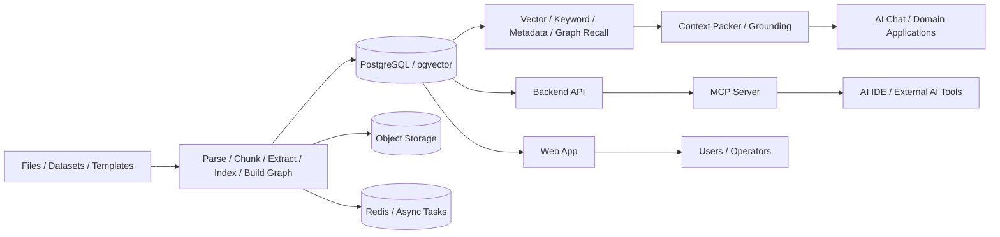

# AtomAIBase

面向行业 AI 应用的知识与数据原子能力底座。

AI-native knowledge and data foundation template for industry applications.


AtomAIBase 是一个可复用的 AI 应用开发模板，内置文档解析、结构化数据要素抽取、RAG、知识图谱、数据要素模板、多租户隔离和 MCP / AI IDE 协作能力。它关注的不是单点 AI 功能，而是从知识资产采集、处理、组织到消费的一整条工程化链路。

> 命名迁移说明：项目对外名称已升级为 AtomAIBase。GitHub 仓库路径和部分历史文档中仍可能保留 `MetaEduBase`，这些内容会按任务逐步迁移。

## 为什么是 AtomAIBase

- **完整知识资产生命周期**：文件、数据集和模板进入系统后，可以被解析、分块、抽取、索引、建图、检索和问答消费。
- **行业无关的 AI 原子能力**：RAG、知识图谱、结构化抽取、模板 schema、MCP 接口和多租户能力可以被不同业务场景复用。
- **克制的基础设施路线**：当前阶段优先用 PostgreSQL / pgvector / Redis 承接核心链路，在真实瓶颈出现后再触发多引擎演进。
- **面向长期协作的工程模板**：内置需求、spec、plan、质量门禁、工作台和 AI IDE 交接规则，适合作为可持续迭代的项目底座。

## 核心能力

| 能力域 | AtomAIBase 提供什么 |
|--------|----------------------|
| 知识采集 | 文件、文件夹、数据集、数据要素模板和业务场景样例 |
| 文档处理 | 上传、解析、章节识别、分块、索引、元数据和异步任务编排 |
| 结构化抽取 | 模板字段、嵌套 schema、AI 初始化、抽取结果回显和版本化复用 |
| RAG 问答 | 向量召回、关键词召回、融合排序、Context Packer、grounding 和来源引用 |
| 知识图谱 | 知识节点、关系边、图谱管理、图谱证据链和关系扩展召回 |
| 数据处理 | Excel / CSV 导入、行级处理、结构化知识抽取和图谱构建 |
| 行业复用 | 可扩展到企业知识库、政策法规、产品运营、文档抽取等场景的模板机制 |
| AI 工具集成 | 面向外部 AI 工具的 MCP Server，以及面向 AI IDE 协作的工程事实源 |

## 适用场景

- 企业内部知识库和智能问答
- 行业资料、政策法规、标准规范的 RAG 应用
- 合同、方案、报告、业务资料等文档的数据要素抽取
- 需要知识图谱辅助检索、问答或业务分析的领域系统
- 需要快速搭建 AI 应用样板工程的团队
- 需要把 AI IDE 协作、任务事实源和质量门禁纳入工程流程的项目

## 系统架构



## 系统组成

| 组件 | 位置 | 职责 |
|------|------|------|
| Web App | `packages/web` | Vue 前端应用，承载知识库、资源库、数据集、模板、图谱和管理界面 |
| Backend API | `packages/server-python` | FastAPI 后端，负责认证、领域服务、异步任务编排和数据访问 |
| Shared Contracts | `packages/shared` | 前端共享 schema / type / helper，减少契约漂移 |
| MCP Server | `packages/mcp-server` | 面向外部 AI 工具的知识操作接口 |
| Deploy | `deploy/` | PostgreSQL、Redis、对象存储和本地 / 容器化运行配置 |

## 快速开始

### 环境要求

- Python 3.12+
- Node.js 20+
- pnpm 9+
- PostgreSQL、Redis 和对象存储的本地开发环境

### 启动本地开发环境

```bash
git clone https://github.com/MarkDanile/MetaEduBase.git
cd MetaEduBase
pnpm install
cd packages/server-python && make install && cd ../..

./dev.sh init-db
./dev.sh
```

启动后默认访问：

- Web: `http://localhost:3000`
- API Docs: `http://localhost:8000/docs`

默认开发账号、测试库初始化、日志查看、分服务启动和更多命令见 [local-development.md](docs/03-engineering-governance/01-rules/local-development.md)。

## 技术栈

| 层级 | 技术 |
|------|------|
| Frontend | Vue 3, Vite, TypeScript, TanStack Vue Query, Vue Flow, ECharts |
| Backend | Python 3.12, FastAPI, SQLAlchemy, Alembic, Celery |
| Data | PostgreSQL, pgvector, zhparser, Redis, Object Storage |
| AI / RAG | Embedding, hybrid retrieval, RRF, Context Packer, grounded answer generation |
| Tooling | pnpm, Turborepo, pytest, Vitest, Ruff, MCP |

## 应用场景

AtomAIBase 的核心能力可以组合成多类行业 AI 应用，下面是适合二次开发的典型方向。

| 场景 | 说明 |
|------|------|
| Enterprise Knowledge Base | 企业制度、项目资料、产品文档、运营知识等资料管理和智能问答 |
| Policy / Regulation Assistant | 政策法规、标准规范、申报材料和问答检索 |
| Domain Data Extraction Workflow | 合同、报告、表单、业务材料的数据要素抽取和复用 |
| Knowledge Graph Enhanced RAG | 用知识节点、关系边和原文证据增强检索、问答和业务分析 |

## 路线图

当前项目处于 P2 Growth Phase：在 P1 已验证文档抽取和 RAG 问答链路后，继续提升召回质量、抽取质量和系统稳定性。

| 阶段 | 状态 | 目标 |
|------|------|------|
| P1 Validation | Done | 在最少基础设施依赖下验证 RAG 问答链路和文档抽取链路 |
| P2 Growth | Doing | 增强中文搜索、图谱关系召回、融合排序、Query Understanding 和 grounding |
| P3 Scale | Future | 按容量、性能、可用性和质量瓶颈演进到多引擎、多模态和可观测能力 |

更多规划见 [Product Roadmap](docs/01-product-planning/01-roadmap.md)。

## 文档导航

| 你想了解 | 先读这里 |
|----------|----------|
| 系统目标、边界、上下文和关键流程 | [ARCHITECTURE.md](ARCHITECTURE.md) |
| 产品路线图、里程碑和需求池 | [docs/01-product-planning/](docs/01-product-planning/README.md) |
| 已进入交付的需求 / 验收标准 | [docs/02-delivery-plans/01-specs/](docs/02-delivery-plans/01-specs/README.md) |
| 已进入交付的实施计划 / 任务拆分 | [docs/02-delivery-plans/02-plans/](docs/02-delivery-plans/02-plans/README.md) |
| 当前任务、交接状态和下一步 | [docs/03-engineering-governance/current-work.md](docs/03-engineering-governance/current-work.md) |
| 本地开发、测试库初始化和常用命令 | [local-development.md](docs/03-engineering-governance/01-rules/local-development.md) |
| 质量门禁、验证矩阵和完成标准 | [quality-gates.md](docs/03-engineering-governance/01-rules/quality-gates.md) |
| Git 提交、PR 和合并流程 | [git-workflow.md](docs/03-engineering-governance/01-rules/git-workflow.md) |

## 开发与 AI 协作

这个仓库默认按“仓库文档是事实源，插件只是执行工具”来协作。

开始任何开发任务前：

1. 先读 [current-work.md](docs/03-engineering-governance/current-work.md)
2. 若涉及交接、plan-do、superpower 或其他 AI IDE，再读 [workflow.md](docs/03-engineering-governance/workflow.md)
3. 按任务类型进入 [task-modes.md](docs/03-engineering-governance/task-modes.md)

`AGENTS.md`、`CLAUDE.md` 和其他 IDE 兼容目录都应把共享规则指回 `docs/03-engineering-governance/*`，而不是各自维护第二份事实源。

## License

MIT
