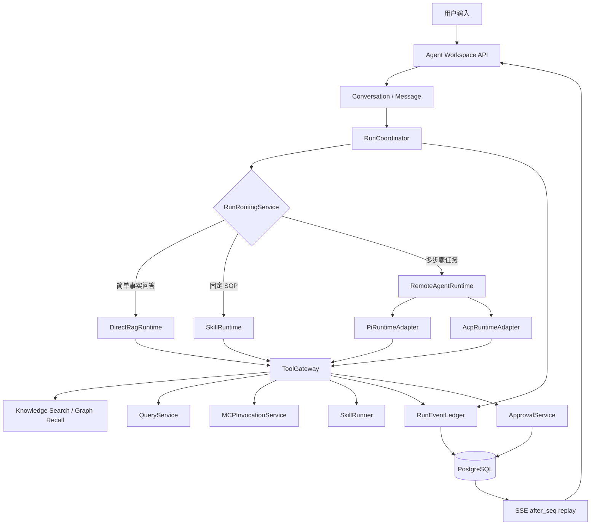

# REQ-059 Spec: 企业级可控 Agent 平台源码研究与控制面契约

> **Status**: 🟣 Shaping
> **Requirement**: `docs/01-product-planning/05-requirements/REQ-059-enterprise-agent-platform-kernel.md`
> **Related**: REQ-041 / REQ-042 / REQ-043 / REQ-047 / REQ-060 / REQ-061 / TD-085
> **Research baseline**: 2026-07-23
> **Purpose**: 冻结架构边界、统一命名和实施顺序；本 spec 不代表对应代码已经落地

---

## 1. 结论先行

MetaEduBase 的目标不是再增加一个“会循环调用工具的 RAG 服务”，而是建设一套类似 Codex 的企业 Agent Harness：

- 产品级 Conversation、Message、AgentRun、RunEvent、Approval、Artifact、Evidence 和 Memory 由 MetaEduBase 持久化并治理。
- Direct RAG、确定性 SkillRunner、Pi Agent Loop 和 ACP 外部 Agent 都是可路由的 Runtime，不拥有企业产品事实源。
- Pi 最适合作为首个 Native Agent Runtime 内核，但其源码明确不提供企业权限、MCP、审批、计划模式或沙箱边界。
- ACP 适合做南向 Runtime 协议和能力协商，不适合作为业务编排、产品会话或企业权限事实源。
- OpenClaw 最值得借鉴 Runtime Port、Session Actor、Event Ledger、Approval 和 Task Recovery；不能继承其单 Operator 信任域。
- Nuwax/NuwaClaw 最值得借鉴 ACP Session/Permission 的产品适配；其内存状态、默认 yolo、沙箱降级和 load 失败回退不能进入生产默认值。
- Open Design 最值得借鉴 Runtime Agent Definition、Conversation/Runtime Session 分离、Run Event、Tool Token 和 Agent Workspace 产品模式；它仍是 local-first 单用户产品，不是企业控制面。
- Codex 开源源码最值得借鉴 Thread/Turn/Item、App Server、ThreadManager、Session/TurnContext、ToolRouter/ToolRegistry、Rollout/State DB、Permission/Sandbox 和 Skill/MCP 的分层；未公开的桌面服务端实现不得猜测。

推荐采用“源码级 SDK 集成 + 独立部署单元”，而不是“页面集成”或“整体 fork”：

```text
MetaEduBase Web
  -> MetaEduBase API / SSE
      -> Agent Control Plane (Python + PostgreSQL)
          -> DirectRagRuntime / SkillRuntime
          -> Agent Runtime Worker (Node.js, pinned Pi SDK)
          -> ACP Runtime Adapter (external agents)
          -> Tool Gateway -> existing RAG / MCP / SkillRunner / QueryService
```

## 2. 证据规则与源码快照

### 2.1 事实优先级

本次结论按以下顺序裁决冲突：

1. 固定 commit 的实际源码与测试。
2. 同 commit 的仓库文档和协议说明。
3. README、架构图和发布说明。
4. 飞书专家解读、文章和二手案例。
5. 无法回溯数据集与评测方法的宣传数字不进入验收基线。

### 2.2 研究快照

| 项目 | 快照 | 定位 |
|------|------|------|
| OpenClaw | [`5e651d5`](https://github.com/openclaw/openclaw/tree/5e651d5ac76ce2ad41e1a0205bed210f818ad8b9) | 个人 AI Assistant Gateway / Harness |
| Pi | [`a5afc3f`](https://github.com/earendil-works/pi/tree/a5afc3f171e422e08a2ccc342827719f9952f38a) | Agent Loop SDK、Session 与 Coding Agent |
| Nuwax Web | [`1278e30`](https://github.com/nuwax-ai/nuwax/tree/1278e30dc42fff2c741185775f7cade5bf01389e) | Agent 产品前端 |
| NuwaClaw | [`77bccef`](https://github.com/nuwax-ai/nuwaclaw/tree/77bccefe701a5a73895dced587fea0636c7216f6) | Electron Agent Client、ACP Engine 与权限交互 |
| RCoder | [`2189eaf`](https://github.com/nuwax-ai/rcoder/tree/2189eaffc4d2a6b0bc92b988c859698b0377124b) | Rust Agent Runner、Session 与 Permission Manager |
| Claude ACP Adapter | [`3b72577`](https://github.com/agentclientprotocol/claude-agent-acp/tree/3b725779996a7c8b99b26ef3553abb915423037a) | ACP 到 Claude Agent SDK 的适配 |
| Open Design | [`506c290`](https://github.com/nexu-io/open-design/tree/506c2900b972e6f3a25cfe5fabd7041ec6d869ca) / `0.16.1` | Local-first Agent Workspace 与 Runtime Adapter |
| Codex | [`39a2438`](https://github.com/openai/codex/tree/39a2438d16514d0d6f88105d17b0f747994af487) | Coding Agent Core、App Server 与 Harness |

进入实施 Spike 前必须重新固定版本、许可证、Node/Python/Rust 运行要求和破坏性变更，不允许使用浮动 `latest`。

### 2.3 专家解读的可用范围

| 材料 | 可取之处 | 源码校正 |
|------|----------|----------|
| OpenClaw 解读 | 正确关注会话、记忆、工具、任务和 Gateway | “固定四层记忆”、视觉记忆和 `MRR@10=0.87` 未在本快照源码/官方文档找到；实际是 Markdown 记忆文件、搜索工具和可插拔后端 |
| Pi 解读 | Agent Loop、并行/串行工具、Hook、steer/follow-up、compaction 基本准确 | Pi README 明确默认继承宿主进程权限；Coding Agent README 明确无内建 MCP、sub-agent、permission popup、plan mode 和 todo |
| Nuwax 解读 | ACP 适配层、能力协商和 Intervention 交互值得参考 | Nuwax 主仓是前端，Runtime 分散在多个仓库；标准 Apache-2.0 无“商业使用需额外授权”条款；不能把 README 架构图视为单仓已交付能力 |
| Open Design 解读 | Agent Workspace、插件和设计任务闭环方向有价值 | 材料基于早期 `0.1.0 Draft`；当前 `0.16.1` 已有桌面应用、Plugin、Automation、Memory、MCP、ACP、Pi RPC、SQLite 与 Run Event |

## 3. RAG 1.0 到 4.0 的准确解释

“RAG 1.0 / 2.0 / 3.0 / 4.0”不是论文共同定义的标准版本号。可以保留为企业内部能力成熟度语言，但必须映射到可验证能力，不能把行业文章中的准确率数字当作项目基线。

| 内部阶段 | 论文/工程能力 | MetaEduBase 对应现状 | 主要缺口 |
|----------|---------------|----------------------|----------|
| 1.0 基础 RAG | chunk -> dense retrieval -> prompt generation；对应 RAG、DPR 基础范式 | 已跨过 | 召回偏差、上下文缺口、冲突与引用治理 |
| 2.0 Retrieval Optimization | query understanding/rewrite、hybrid retrieval、RRF、rerank、context packing | 已具备多路召回、RRF、图谱召回、context packing 和 diagnostics | 评测集、路由、跨工具任务与统一状态容器 |
| 3.0 Adaptive/Corrective RAG | 按查询复杂度路由、检索质量评估、重写与有限重试；Self-RAG、CRAG、Adaptive-RAG、RAPTOR、GraphRAG 分别解决不同子问题 | 局部能力存在，尚无统一 Run/事件/策略 | 不能把 GraphRAG 等同于完整 Agent；不能把所有请求都升级为多轮检索 |
| 4.0 Agentic RAG | Agent Loop 使用检索、数据、MCP、Skill 等工具，带计划、预算、审批、恢复和产物 | 目标态 | Harness、Tool Gateway、Runtime Port、持久化审批、沙箱、记忆治理和评测 |

基础参考：

- [Retrieval-Augmented Generation for Knowledge-Intensive NLP Tasks](https://arxiv.org/abs/2005.11401)
- [Dense Passage Retrieval](https://arxiv.org/abs/2004.04906)
- [Self-RAG](https://arxiv.org/abs/2310.11511)
- [Corrective Retrieval Augmented Generation](https://arxiv.org/abs/2401.15884)
- [Adaptive-RAG](https://arxiv.org/abs/2403.14403)
- [RAPTOR](https://arxiv.org/abs/2401.18059)
- [From Local to Global: A Graph RAG Approach](https://arxiv.org/abs/2404.16130)

“60% -> 80% -> 85%”只有在固定问题集、答案标准、检索版本、模型版本和评分方法下才有意义。本项目必须重新建立教育和园区数据集，不采用该数字作为 AC。

## 4. 五个源码样本的结构性结论

### 4.1 OpenClaw：控制面和恢复机制参考

关键源码：

- [`packages/acp-core/src/runtime/types.ts`](https://github.com/openclaw/openclaw/blob/5e651d5ac76ce2ad41e1a0205bed210f818ad8b9/packages/acp-core/src/runtime/types.ts)：`AcpRuntime`、`AcpRuntimeTurn`、事件流与独立 terminal result。
- [`src/acp/event-ledger.ts`](https://github.com/openclaw/openclaw/blob/5e651d5ac76ce2ad41e1a0205bed210f818ad8b9/src/acp/event-ledger.ts)：单调 `seq`、完整性标记、SQLite/内存 Event Ledger 和重放。
- [`src/gateway/server-methods/approval-shared.ts`](https://github.com/openclaw/openclaw/blob/5e651d5ac76ce2ad41e1a0205bed210f818ad8b9/src/gateway/server-methods/approval-shared.ts)：持久化审批、revision/runtime epoch、first-answer-wins。
- [`src/tasks/task-registry.ts`](https://github.com/openclaw/openclaw/blob/5e651d5ac76ce2ad41e1a0205bed210f818ad8b9/src/tasks/task-registry.ts)：Task Registry、恢复、阻塞和取消意图。

直接借鉴：

- Runtime Handle 和 Runtime Session 分离。
- `startTurn -> events + result`，终态不依赖流中的最后一帧。
- 同 Session 可变操作使用 actor queue 串行化。
- Event Ledger 记录重放完整性，事件被裁剪后必须标记 incomplete。
- Approval 是持久化状态机，不是一个等待中的 Promise。

拒绝继承：

- OpenClaw 安全文档明确默认面向一个可信 Operator，不是 hostile multi-tenant isolation。
- 不能把其 Gateway、主机权限或本地记忆目录直接作为共享企业服务边界。

### 4.2 Pi：首个 Native Agent Runtime 内核

关键源码：

- [`packages/agent/src/agent-loop.ts`](https://github.com/earendil-works/pi/blob/a5afc3f171e422e08a2ccc342827719f9952f38a/packages/agent/src/agent-loop.ts)：统一 Agent Loop、工具批次、steering、follow-up、stop hook。
- [`packages/agent/src/types.ts`](https://github.com/earendil-works/pi/blob/a5afc3f171e422e08a2ccc342827719f9952f38a/packages/agent/src/types.ts)：AgentContext、AgentEvent、Tool 与 Loop 配置。
- [`packages/agent/src/harness/types.ts`](https://github.com/earendil-works/pi/blob/a5afc3f171e422e08a2ccc342827719f9952f38a/packages/agent/src/harness/types.ts)：Harness Hook 和 Session 抽象。
- [`packages/agent/src/harness/session/session.ts`](https://github.com/earendil-works/pi/blob/a5afc3f171e422e08a2ccc342827719f9952f38a/packages/agent/src/harness/session/session.ts)：append-only tree、branch、compaction 和可替换 `SessionStorage`。

直接借鉴：

- 一个统一 Loop 驱动模型、工具结果和后续 turn，不单独制造 `Planner`、`Executor`、`Evaluator` 三套状态机。
- `transformContext`、`prepareNextTurn`、before/after tool hook、`shouldStopAfterTurn` 是企业策略的接入点。
- SessionStorage/SessionRepo 可适配到自有存储，但 Pi Session 仍只作为 Runtime 私有状态。

必须外围实现：

- tenant/identity/RBAC/ABAC、凭证、MCP Gateway、Approval、Sandbox、Audit、Budget、Artifact、长期记忆。
- Pi README 明确默认拥有启动进程的文件、进程、网络和凭证权限；不能在 Backend API 进程内直接运行。

### 4.3 Nuwax/NuwaClaw：ACP 产品适配样本

关键源码：

- `UnifiedAgentService -> AcpEngine` 和 per-project Engine Registry。
- `acpSessionSetup.ts` 实现 memory/load/new 的 Session 解析。
- `permissionCoordinator.ts` 实现规则、strict write guard 和 ask/yolo 决策。
- `approvalInterventionService.ts` 实现 option 白名单、revision 和 first-answer-wins 的交互状态。
- `acpSandboxPolicy.ts` 把全局沙箱策略映射到 ACP 进程配置。

直接借鉴：

- ACP `initialize/new/load/resume/prompt/cancel` 的能力协商和事件映射。
- Permission Request 转为产品 Intervention，再把用户选择映射回 ACP。
- Session 恢复时抑制历史 SSE 重复渲染。
- strict write guard 对写路径做宿主侧二次校验。

生产禁用项：

- `ApprovalInterventionService.pending` 是进程内 `Map`，进程重启后 pending 审批消失。
- `PermissionManager.pending/session_state/recent_resolutions` 和 Engine/Session Registry 主要是内存状态。
- `getEffectiveMode()` 缺省返回 `yolo`。
- `loadSession` 失败或 Runtime 不支持 load 时，`acpSessionSetup.ts` 会创建新 Session；企业产品必须返回显式 `resume_failed`，防止历史丢失或串会话。
- 沙箱配置默认 `networkEnabled: true`、`fallback: degrade_to_off`；策略解析异常会无沙箱继续运行。企业生产必须 network deny by default 且 fail closed。

Claude ACP Adapter 本身对不存在 Session 返回 `resourceNotFound`，因此“静默新建”是 NuwaClaw 产品适配层选择，不是 ACP 的必然语义。

### 4.4 Open Design 0.16.1：Workspace 和 Adapter 产品模式参考

关键源码：

- [`apps/daemon/src/runtimes/types.ts`](https://github.com/nexu-io/open-design/blob/506c2900b972e6f3a25cfe5fabd7041ec6d869ca/apps/daemon/src/runtimes/types.ts)：`RuntimeAgentDef` 数据规范。
- [`apps/daemon/src/runtimes/registry.ts`](https://github.com/nexu-io/open-design/blob/506c2900b972e6f3a25cfe5fabd7041ec6d869ca/apps/daemon/src/runtimes/registry.ts)：Generic Engine 的 detection/launch/invoke/stream parsing。
- [`apps/daemon/src/agent-protocol/acp/session.ts`](https://github.com/nexu-io/open-design/blob/506c2900b972e6f3a25cfe5fabd7041ec6d869ca/apps/daemon/src/agent-protocol/acp/session.ts)：ACP Session。
- [`apps/daemon/src/agent-protocol/pi-rpc/session.ts`](https://github.com/nexu-io/open-design/blob/506c2900b972e6f3a25cfe5fabd7041ec6d869ca/apps/daemon/src/agent-protocol/pi-rpc/session.ts)：Pi RPC 和 Session Resume。
- [`apps/daemon/src/tool-tokens.ts`](https://github.com/nexu-io/open-design/blob/506c2900b972e6f3a25cfe5fabd7041ec6d869ca/apps/daemon/src/tool-tokens.ts)：Run-scoped Tool Token、endpoint/operation allowlist、TTL 和 revoke。
- [`apps/daemon/src/db.ts`](https://github.com/nexu-io/open-design/blob/506c2900b972e6f3a25cfe5fabd7041ec6d869ca/apps/daemon/src/db.ts)：Conversation、Message 与 Runtime Session identity 分离。

直接借鉴：

- Adapter 使用数据定义和通用 Engine，避免每个 CLI 重写完整编排器。
- 产品 Conversation 与 Runtime Session 分离，并保存 model/cwd/last_message_id 等恢复身份。
- Skill 每 Run 复制到隔离工作目录，避免修改源 Skill。
- SSE 支持 `Last-Event-ID`；Run Event 写 JSONL 供观察。
- Tool Token 绑定 Run、Project、Endpoint、Operation、TTL 和撤销。
- Workspace 以对话、运行过程、Artifact 为核心，而不是营销式 Chat 页面。

生产禁用项：

- Run Registry、Tool Token Registry 仍是进程内 Map；JSONL/状态不能完整恢复运行。
- ACP permission request 自动选择 session/always/once 中的允许项。
- Pi extension confirm 自动回答 `{confirmed: true}`。
- 多个 CLI 使用 `--allow-all-tools` 或 `--dangerously-skip-permissions` 等 headless 放权。
- Memory 是 global/project 文件存储，无 tenant/user/agent/purpose 企业治理。

### 4.5 Codex：目标 Harness 的公开源码校准

关键源码：

- [`codex-rs/app-server/README.md`](https://github.com/openai/codex/blob/39a2438d16514d0d6f88105d17b0f747994af487/codex-rs/app-server/README.md)：公开协议定义 Thread、Turn、Item，支持 start/resume/fork、turn start/steer/interrupt、流式 item 和 terminal turn。
- [`codex-rs/core/src/thread_manager.rs`](https://github.com/openai/codex/blob/39a2438d16514d0d6f88105d17b0f747994af487/codex-rs/core/src/thread_manager.rs)：ThreadManager 和 loaded thread 生命周期。
- [`codex-rs/core/src/session/session.rs`](https://github.com/openai/codex/blob/39a2438d16514d0d6f88105d17b0f747994af487/codex-rs/core/src/session/session.rs)：Session 核心状态与服务。
- [`codex-rs/core/src/session/turn_context.rs`](https://github.com/openai/codex/blob/39a2438d16514d0d6f88105d17b0f747994af487/codex-rs/core/src/session/turn_context.rs)：每 Turn 不可变/派生执行上下文。
- [`codex-rs/core/src/tools/router.rs`](https://github.com/openai/codex/blob/39a2438d16514d0d6f88105d17b0f747994af487/codex-rs/core/src/tools/router.rs)：ToolRouter 构建 model-visible specs 和 dispatch。
- [`codex-rs/core/src/tools/registry.rs`](https://github.com/openai/codex/blob/39a2438d16514d0d6f88105d17b0f747994af487/codex-rs/core/src/tools/registry.rs)：ToolRegistry、CoreToolRuntime、Hook 和 lifecycle。
- [`codex-rs/rollout/src/recorder.rs`](https://github.com/openai/codex/blob/39a2438d16514d0d6f88105d17b0f747994af487/codex-rs/rollout/src/recorder.rs)：RolloutRecorder、resume 和历史列表。
- `codex-rs/protocol`：Op/Event、Approval、Sandbox 与网络权限协议。

对 MetaEduBase 的核心启示：

- “像 Codex”首先是 Thread/Turn/Item 和 App Server/Harness，不是先做一个 Planner 类。
- 计划是 Turn 中的结构化 Item/Event，工具调用是 ToolRouter/Registry 生命周期，权限是独立协议。
- Session 与 TurnContext 分离，允许同一 Thread 在不同 Turn 使用不同模型、权限和工作区快照。
- Rollout、State DB 与 loaded Thread 是不同层；持久化事实不能等同于内存句柄。
- Codex 的本地开发权限模型不能直接替代教育/园区多租户策略；企业层仍由 MetaEduBase 持有。

## 5. 源码能力对比矩阵

| 维度 | OpenClaw | Pi | Nuwax/NuwaClaw | Open Design | Codex | MetaEduBase 采用 |
|------|----------|----|-----------------|-------------|-------|------------------|
| 核心定位 | Assistant Gateway/Harness | Agent Loop SDK | 产品 + ACP Client | Local Agent Workspace | Coding Agent Harness | 企业 Control Plane + Agent Apps |
| Loop | 外部 Runtime | 强 | 外部 ACP Engine | 多 CLI/ACP/Pi | 强 | Pi 首期，Runtime 可替换 |
| 产品会话 | 有，偏个人 | Runtime Session | App/ACP Session | Conversation + agent session | Thread/Turn/Item | Conversation/Message + AgentRun/Event |
| Runtime Port | `AcpRuntime` | SDK API | `AcpEngine` | `RuntimeAgentDef`/Generic Engine | App Server/Core | `AgentRuntimePort` |
| 事件恢复 | SQLite Event Ledger | Session tree，不是企业 event log | SSE 与 replay 抑制 | JSONL + SSE | Rollout + protocol event | PostgreSQL `RunEventLedger` + SSE |
| MCP/Tool | 强 | 核心无 MCP | ACP 注入 | MCP/connector/tool token | ToolRouter/Registry + MCP | 统一 `ToolGateway` |
| Skill | 文件/插件 | Extension/README | 产品能力 | 每 Run 隔离复制 | Skill service | 区分 deterministic Skill 与 Agent Skill |
| Approval | durable 设计强 | 无内建 | 交互好、状态主要在内存 | 自动批准风险 | 独立 approval protocol | PG 持久化、first-answer-wins |
| Sandbox | 有但非多租户边界 | 需外围 | 可降级关闭 | 多 Runtime 默认放权风险 | 显式 FS/network policy | fail closed、network deny、workspace lease |
| Memory | Markdown + 可插拔检索 | compaction/session | 自动抽取倾向 | global/project 文件 | 独立 memory subsystem | tenant/user/agent/purpose 治理 |
| 多租户 | 否 | 否 | 未形成共享企业边界 | 否 | 本地/产品自身边界 | MetaEduBase 强制拥有 |
| 集成结论 | 参考设计 | 固定 SDK 版本接入 | 参考 ACP Adapter | 参考产品和 Adapter | 参考公开 Harness | 不整体 fork 任一项目 |

## 6. MetaEduBase 当前源码事实

当前项目已经拥有可复用能力，不应重建：

- `knowledge/application/ai_chat_service.py`：多路召回、Fusion、Context Packing、Prompt、LLM 和一次 `query_internal_data` Tool Calling。
- `structured_data/application/query_service.py`：受权限、语义模型和审计治理的智能问数。
- `mcp_registry`：tenant 级 MCP Registry、凭证引用、SSRF 防护、调用与审计。
- `skill_registry/application/skill_runner.py`：确定性 SOP 执行器。
- `due_diligence`：首个 Agent App 和真实业务回归样例。

当前结构风险：

- `AIChatService` 已到 1015 行，同时持有 Retrieval、Prompt、LLM 和 Tool Calling；不能继续把 Agent Loop 塞入该类。
- `AIChatService._call_llm*` 从 application 反向导入 API Router，LLM Port 尚未抽离。
- `SkillRunner` 和 `dd_query_runner` 混入企业背调 Prompt、QCC 参数映射和 evidence 逻辑，通用能力被第一个业务场景反向塑形。
- 还没有产品级 Conversation/Message、AgentRun/RunEvent、Approval/Artifact、Runtime Binding 和 Tool Grant。

因此不能“新增一个 `agent` context + Planner/Executor/Evaluator，然后顺手拆 AIChatService”。正确做法是先冻结控制面契约，再以特征测试渐进迁移现有链路。

## 7. 目标术语与代码命名

### 7.1 产品术语映射

| MetaEduBase 术语 | Codex 对照 | 说明 |
|------------------|------------|------|
| `Conversation` | Thread | 产品级长期会话，面向普通业务用户 |
| `Message` | User/Agent Message Item | 用户可见消息，不承载所有运行对象 |
| `AgentRun` | Turn | 一次请求到 terminal result 的运行 |
| `RunEvent` | Item/Event | 阶段、计划摘要、工具、审批、产物、usage 和错误 |
| `RuntimeSessionBinding` | loaded Session/runtime state | 产品 Conversation 到 Runtime 私有 Session 的可丢失绑定 |
| `Artifact` / `EvidenceItem` | generated item/tool result 的业务扩展 | 报告、表格、草稿和可追溯证据 |

不直接把后端实体命名为 Thread/Turn，是因为 MetaEduBase 已面向教育和园区业务，`Conversation/AgentRun` 语义更清晰；通过映射保留 Codex 架构经验。

### 7.2 不采用三个通用类

`Planner / Executor / Evaluator` 可用于解释能力，不建议直接成为三个核心服务：

- Pi 源码使用统一 Agent Loop，没有三个独立持久化状态机。
- 计划应是 `RunPlan` 数据或 `plan_summary` 事件，不是另一个会话事实源。
- 工具执行应进入 `ToolRouter/ToolGateway`，不由通用 Executor 绕过策略。
- 评估拆为可验证策略：`EvidencePolicy`、`BudgetPolicy`、`StopPolicy`；模型自反思仍留在 Runtime Loop。

建议应用服务命名：

| 名称 | 职责 | 源码依据 |
|------|------|----------|
| `RunCoordinator` | 创建 Run、路由 Runtime、持久化 binding、接收事件、处理终态/取消 | OpenClaw Runtime Manager、Codex Thread/Turn lifecycle |
| `RunRoutingService` | 选择 `direct_rag / deterministic_skill / agent_runtime` | Adaptive-RAG 思路，企业策略实现 |
| `AgentRuntimePort` | Runtime 中立的 create/resume/start/cancel/close contract | OpenClaw `AcpRuntime`、Open Design Runtime Agent、Codex App Server |
| `RuntimeRegistry` | 按 runtime id/capability 选择 Adapter | OpenDesign Registry、OpenClaw Runtime Registry |
| `ToolRouter` | 生成本 Run 模型可见工具集合 | Codex `ToolRouter` |
| `ToolGateway` | Tool Grant 校验、策略、调用、审计和结果裁剪 | Codex ToolRegistry、Open Design Tool Token |
| `ContextAssembler` | 组装 Message、Summary、Memory、RAG Evidence 和 Tool Result | Pi `transformContext`、Codex TurnContext |
| `RunEventLedger` | 分配 seq、持久化、重放和完整性 | OpenClaw Event Ledger |
| `ApprovalService` | durable approval、幂等、revision/epoch、过期 | OpenClaw Approval |
| `EvidencePolicy` | 覆盖度、冲突、来源和停止/重试判定 | CRAG/Self-RAG 的企业可验证部分 |
| `BudgetPolicy` / `StopPolicy` | step/token/time/cost/tool retry 上限 | Pi stop hook、Agent Harness 通用约束 |

### 7.3 目标目录草案

目录只在对应 Requirement 进入 Ready 后创建；当前用于冻结命名和依赖方向：

```text
packages/server-python/app/contexts/
├── agent_workspace/
│   ├── application/
│   │   └── conversation_service.py
│   ├── domain/
│   │   ├── conversation.py
│   │   └── message.py
│   ├── infrastructure/
│   └── interfaces/api/
├── agent_execution/
│   ├── application/
│   │   ├── run_coordinator.py
│   │   ├── run_routing_service.py
│   │   ├── context_assembler.py
│   │   └── tool_gateway.py
│   ├── domain/
│   │   ├── agent_run.py
│   │   ├── run_event.py
│   │   ├── runtime_session_binding.py
│   │   ├── tool_call.py
│   │   ├── tool_grant.py
│   │   ├── approval_request.py
│   │   ├── artifact.py
│   │   ├── evidence_item.py
│   │   └── ports/
│   │       ├── agent_runtime.py
│   │       └── run_event_ledger.py
│   ├── infrastructure/
│   │   ├── runtimes/
│   │   │   ├── direct_rag_runtime.py
│   │   │   ├── skill_runtime.py
│   │   │   └── remote_agent_runtime.py
│   │   └── persistence/
│   └── interfaces/api/
└── agent_memory/                         # REQ-061 进入 Ready 后
    ├── application/context_memory_service.py
    ├── domain/memory_item.py
    └── infrastructure/

packages/agent-runtime-worker/            # REQ-043 Pi Spike 验证后
├── src/runtime/runtime-server.ts
├── src/runtime/runtime-registry.ts
├── src/runtime/pi-runtime-adapter.ts
├── src/runtime/acp-runtime-adapter.ts
├── src/session/runtime-session-registry.ts
├── src/events/runtime-event-mapper.ts
└── src/tools/tool-gateway-client.ts
```

`runtime-session-registry` 只能缓存 live handle；`RuntimeSessionBinding` 必须先写 PostgreSQL。Worker 重启后缓存可丢失，控制面必须把 Run 恢复为 `resume_required / failed`，不能假装仍在运行。

## 8. 目标运行流程



### 8.1 Adaptive Route

路由不是一次性 LLM 分类器，而是可审计的分层策略：

1. 显式产品入口或 Agent App 固定 route 优先。
2. 规则识别单轮 FAQ、固定 SOP、写操作和敏感场景。
3. 只有模糊边界才调用轻量 classifier。
4. 路由结果写入 `AgentRun.route` 和 `routing_reason`，支持离线评测与回放。

建议初始分布目标不是硬编码“60%-70%”，而是用真实流量评测后设定。默认原则是能走 Direct RAG 的请求不进入 Pi，以保护 P95 延时和成本。

### 8.2 Agent Loop

多步骤路径由 Pi Agent Loop 驱动：

- 模型根据系统指令和可见 Tool Specs 产生计划摘要和工具调用。
- Tool 调用全部回到 MetaEduBase Tool Gateway。
- `EvidencePolicy` 把缺失、冲突和来源不足转为结构化 Tool Result/next-turn context。
- `BudgetPolicy` 与 `StopPolicy` 通过 Pi Hook/stop hook 限制循环。
- 最终回答和结构化 Artifact 由 RunCoordinator 收口，不能由 Worker 直接写业务表。

## 9. 核心契约

### 9.1 AgentRuntimePort

最小语义以 OpenClaw `AcpRuntime`、Codex App Server 和 ACP 能力交集为基线：

```text
initialize() -> RuntimeCapabilities
create_session(input) -> RuntimeSessionHandle
resume_session(binding) -> RuntimeSessionHandle | ResumeError
start_run(handle, input) -> RuntimeRun(events, terminal_result)
get_status(handle)
set_mode(handle, mode)
set_config_option(handle, key, value)
respond_approval(handle, approval_response)
cancel_run(handle, reason)
close_session(handle, discard_persistent_state)
```

硬语义：

- `events` 和 `terminal_result` 分离。
- `resume_session` 失败返回稳定错误，不得自动 `create_session`。
- 一个 Runtime Session 同时最多一个可变 Turn；steer/follow-up 进入 Session actor queue。
- 每次调用携带 `tenant_id / conversation_id / run_id / runtime_epoch`，Adapter 不信任 Worker 内存映射。

### 9.2 AgentRun 与 RunEvent

`AgentRun` 是终态事实源：

```text
queued -> running -> waiting_approval -> running
queued/running/waiting_approval -> completed|failed|cancelled|expired
```

`RunEvent` 最小字段：

```text
tenant_id, conversation_id, run_id, seq, event_id,
type, occurred_at, visibility, payload_ref|payload,
runtime_id, runtime_epoch, causation_id, correlation_id
```

建议事件族：

```text
run.started / phase.changed / plan.summary
tool.started / tool.progress / tool.completed / tool.failed
evidence.added / evidence.conflict
approval.requested / approval.resolved / approval.expired
artifact.created / artifact.updated
usage.updated / retry.scheduled / error.reported
run.completed / run.failed / run.cancelled / run.expired
```

原始 Chain-of-Thought 不进入 `RunEvent`；UI 只显示 `plan.summary`、phase、tool lifecycle、证据、审批、usage 和错误摘要。

### 9.3 Tool Gateway 与 Tool Grant

Tool Gateway 是唯一企业调用入口：

```text
Runtime ToolCall
  -> validate ToolGrant(run, tenant, actor, agent, tool, operation, expiry)
  -> Policy decision(deny / allow / require_approval)
  -> invoke adapter
  -> redact / externalize payload
  -> persist ToolCall + audit + RunEvent
  -> return model-facing ToolResult
```

`ToolGrant` 必须是短期、Run-scoped、可撤销凭证，至少绑定：

- tenant、actor、agent、run、runtime epoch。
- tool id/version、允许 operation、参数约束和风险等级。
- TTL、最大调用数、预算和 purpose。

Runtime Worker 不获得 MCP secret、数据库连接或租户长期 Token。

### 9.4 Approval

审批不是 Runtime UI Promise。`ApprovalRequest` 至少持久化：

- tenant/run/tool_call/runtime_epoch/revision。
- risk、参数摘要、option 白名单、reviewer scope。
- pending/resolved/rejected/expired/cancelled/superseded。
- expires_at、resolved_by、resolved_at 和 response digest。

并发规则：first-answer-wins；相同响应幂等成功，不同响应稳定冲突。服务重启后仍可查询和处理；Runtime 已丢失时审批只能终结为 superseded/cancelled，不能执行旧 Tool Call。

### 9.5 Sandbox 与 Workspace

生产默认：

- Worker 与 FastAPI API 分进程/容器；Pi 不在 API 进程内执行。
- 每 Run 或每受控 Session 使用 `WorkspaceLease`，只挂载允许目录。
- 文件系统默认 read-only，写目录 allowlist；网络默认 deny，按域名/IP/协议 allowlist。
- sandbox unavailable、policy parse error、mount failure 和 network policy failure 全部 fail closed。
- 高风险租户或写任务使用独立 Runtime Cell；只读低风险任务可共享 Worker 池。
- Tool Gateway 再做宿主侧策略，Sandbox 不是唯一授权层。

### 9.6 Memory 与 Context

必须区分：

- Working Context：当前 Run 的消息、Tool Result、计划摘要。
- Conversation Summary：压缩历史，不等同长期事实。
- Episodic/Semantic Memory：有 tenant/user/agent/purpose/provenance/TTL 的长期记忆。
- Enterprise Knowledge：现有知识库、结构化数据和图谱，不叫个人记忆。

Pi compaction、OpenClaw Markdown memory、Open Design global/project memory 和 Codex 本地 memory 都只能提供实现参考，不能直接成为企业记忆库。

## 10. 集成与部署决策

### 10.1 Pi

选择：源码级 SDK 集成，部署为独立 Node Runtime Worker。

- 在自有 `packages/agent-runtime-worker` 中固定 `@earendil-works/pi-agent-core` 等具体版本和 lockfile。
- 通过自有 `PiRuntimeAdapter` 使用 Agent Loop、SessionStorage 和 Hook。
- 开发期可以 monorepo package 运行；生产构建为独立容器镜像，由 MetaEduBase 控制版本和回滚。
- 不整体 fork Pi；只有上游 bug 无法扩展且补丁已尝试 upstream 时才维护最小 patch。
- 不嵌入 Pi 页面，不让浏览器连接 Pi RPC。

### 10.2 ACP

选择：作为南向 Runtime 协议，优先与 Pi Worker 使用同一远程 Runtime Port 对接控制面。

- ACP Adapter 负责 capability negotiation、session new/load/resume、prompt/steer、cancel、permission 和 event mapping。
- MetaEduBase Approval/Tool Gateway/Sandbox Policy 包裹 ACP，不信任 Agent 自报权限。
- `session/load` 的 `resourceNotFound`、capability missing 和 cwd/model mismatch 都是显式错误。

### 10.3 OpenClaw、Nuwax、Open Design、Codex

- 不作为 MetaEduBase 页面或主后端整体嵌入。
- 采用其协议、状态机和产品模式，保持许可证引用和源码证据。
- Codex/Claude Code/OpenCode 等未来可作为 ACP External Runtime，仍不拥有 MetaEduBase Conversation、Approval 和 Artifact。

## 11. 分阶段落地与现实工期

以下工期假设为 4-6 人稳定团队：2-3 后端/Runtime、1-2 前端、1 QA/平台兼任；不含采购审批和外部数据接入等待。

| 阶段 | 建议工期 | 交付 | 依赖/门禁 |
|------|----------|------|-----------|
| 0. Contract Freeze | 1-2 周 | 本 spec、Context Map、Runtime/RunEvent/ToolGrant schema、APP-005/009 首批 Rubric、APP-012/030 共享采集边界和 APP-016 研究边界 | REQ-059 Shaping -> Ready |
| 1. Durable Control Plane | 2-3 周 | REQ-041 Conversation/Message；REQ-047 Run/Event/Approval/Artifact 最小表与 API；Direct RAG compatibility path | 不接 Pi；先证明刷新/重连/终态 |
| 2. Workspace & Navigation | 2-3 周 | REQ-042 三栏 Workspace；REQ-060 单一导航/permission source | Playwright desktop/mobile + RBAC matrix |
| 3. Boundary Closure & Tool Gateway | 2-4 周 | TD-085 分 Slice；LLM Port；Direct RAG 收缩；ToolRouter/ToolGateway/ToolGrant | 现有 RAG/问数/Skill/DD 回归全绿 |
| 4. Pi Read-only Pilot | 3-4 周 | Node Worker、PiRuntimeAdapter；先跑 APP-005 只读对照，再以 APP-009 跑真实资产 + 授权外部交通/配套数据的多方案选址；覆盖 RAG + Query + MCP/Skill、多步计划、预算和取消 | sandbox fail closed；无真实 secret 下发；不替换 APP-005 生产 SkillRunner；外部数据经 REQ-063 |
| 5. Approval, Sandbox & ACP | 4-6 周 | durable approval、workspace lease、network allowlist、ACP new/resume/cancel/permission | 故障注入、重启恢复、跨租户攻击测试 |
| 6. Memory & Active Work | 4-6 周 | REQ-061 Memory Governance、REQ-049 schedule/event trigger、评测与运营面板 | 敏感记忆策略、删除/纠正、成本基线 |

可演示 V1 约 8-12 周；满足企业生产治理的 V1 约 16-24 周。任何“2-4 周完成超级智能体”的计划通常只覆盖 Agent Loop 演示，不覆盖多租户、恢复、审批、沙箱、审计和评测。

### 11.1 对原四阶段方案的调整

| 原方案 | 调整 |
|--------|------|
| A. 先建 Planner/Executor/Evaluator Agent Core，并拆 AIChatService | 先做 Contract/RunEvent；TD-085 单独拆依赖倒置；Pi 提供统一 Loop，不新建三个通用类 |
| B. 再做记忆 + 路由 | 路由应在 Pi Pilot 前完成；长期记忆延后，Conversation/Run 持久化不能延后 |
| C. 再接 MCP/Skill | MCP/Skill 已交付；当前工作是 Tool Gateway 包装和授权，不是重建 Registry |
| D. 最后产品化控制台 | 会话、Run、审批和事件 UI 是 Harness 的早期验收面，不应等 Loop 完成后补 |

## 12. 首批企业场景

企业 360 背调是第一个产业园区 AI 应用和 P3 首个平台化样板，但不作为平台基础能力或唯一验收场景。园区近期主线固定为 APP-005 -> APP-009 -> APP-012 -> APP-030 -> APP-016；APP-011 并入 APP-016，APP-022 并入 APP-012，教育样例随后验证跨行业复用。

建议园区五应用验收场景：

| 场景 | Route | 验证重点 |
|------|-------|----------|
| 园区第一号：APP-005 企业 360 背调 | deterministic SkillRunner 生产基线 + Agent Runtime 只读对照 | 接入统一 Conversation/Run/Approval/Artifact/Workspace；保持制审分离、报告/证据和 MCP 审计，不用 Agent 路径直接替换生产编排 |
| 园区第二号：APP-009 AI 载体选址 | Agent Runtime + QueryService + REQ-063 External Data | 真实资产库存、企业硬约束、授权地图/交通数据、多方案权衡、来源时效和人工选择；不自动锁定房源 |
| 园区第三号：APP-012 招商动态报表 | REQ-062 Campaign Workflow + Agent 辅助 | 统计要求解析、系统覆盖判断、动态表单审核发布、多人填报、数据快照、汇总报告和常态模板 |
| 园区第四号：APP-030 会展招商 | REQ-062 Campaign Workflow + Conversation Capture | 历史模板复用、本次字段版本、百人级受众、表单/对话登记、主体去重、进度和领导汇总 |
| 园区第五号：APP-016 产业研究辅助平台 | Research Agent + Skill + REQ-063 External Data + Artifact | 研究计划、授权来源、产业链/企业分析、假设与事实分离、证据化报告和招商指导；吸收 APP-011 |

高风险写操作首期不让自由 Agent 直接执行。Agent 生成草稿或 Action Proposal，确定性 Workflow 校验后进入人工审批，再由受控 Tool 执行。

## 13. 自主等级

| 等级 | 行为 | 默认场景 |
|------|------|----------|
| L0 Observe | Direct RAG/只读查询，只回答与引用 | FAQ、制度问答 |
| L1 Recommend | 多步只读 Agent，输出建议和 Artifact | 备课、经营分析 |
| L2 Draft | 生成工单、通知、方案草稿，不提交外部系统 | 政策申报材料、运营方案 |
| L3 Approve-to-Act | 每次高风险动作经持久化审批 | 工单创建、数据更新 |
| L4 Bounded Auto | 仅 allowlisted Workflow、预算和撤销范围内自动执行 | 成熟的定时报告/提醒 |

L4 不是“yolo”。它必须是明确业务范围、确定性前后置校验、可撤销动作和审计齐备后的策略结果。

## 14. 评测与上线门禁

### 14.1 效果指标

- Route accuracy：Direct RAG / Skill / Agent 分类正确率。
- Task success：按场景验收 Rubric 完成任务的比例。
- Groundedness 与 evidence coverage：关键结论是否有受治理证据。
- Contradiction handling：证据冲突是否显式呈现和升级。
- Tool selection/argument accuracy、Tool failure recovery、human intervention rate。
- Memory precision、错误注入率、过期命中率和删除后残留率。

### 14.2 运行指标

- 各 Route 的 P50/P95 首 token、总时长和排队时间。
- 每 Run step/tool/retry/token/cost。
- resume success、event gap、duplicate event、terminal mismatch。
- approval pending/expired/conflict、sandbox denied、policy denied。

### 14.3 故障与安全门禁

- Worker 进程在 running/waiting_approval 时被 kill，控制面状态可恢复或显式失败。
- SSE 断线后从 `after_seq` 重放，无重复终态和事件缺口静默。
- ACP `session/load` 不存在/损坏时不创建新 Session。
- Sandbox/网络策略不可用时拒绝启动 Run。
- tenant A 的 Conversation、Run、Tool Grant、Approval、Artifact、Memory 对 tenant B 全部不可见且不可调用。
- Runtime 伪造 tenant/run/tool id、重放过期 grant、绕过 Gateway 均失败。

## 15. 冻结决策与待决项

### 15.1 已冻结

- MetaEduBase 是企业控制面和数据事实源。
- 前端只连接 MetaEduBase API/SSE，不页面集成外部 Agent。
- Pi 固定版本 SDK + Node Worker/Sidecar，不整体 fork。
- ACP 是南向 Runtime 协议，不是业务编排引擎。
- Direct RAG、SkillRunner、Agent Runtime 按复杂度分流。
- 不保存或展示原始 Chain-of-Thought。
- Approval、Tool Grant、RunEvent 和 Runtime Binding 必须持久化或可重建；内存 Map 不是事实源。
- `session/load` 失败不得静默创建新 Session；Sandbox 不得 fail open。

### 15.2 REQ-059 Ready 前必须决定

- Python Control Plane 到 Node Worker 使用 HTTP/SSE、NDJSON RPC 还是 gRPC。
- Worker 共享池与 per-tenant Runtime Cell 的分级标准。
- RunEvent payload 外置阈值、保留周期和归档策略。
- Tool Grant 的签名/opaque token、撤销和计费模型。
- APP-005/009/012/030/016 的离线评测集、Rubric、真实数据授权与上线门槛；首个 REQ-062 Campaign 和 REQ-063 Source Registry 样例。
- `agent_workspace` / `agent_execution` 两个 bounded context 是否在首个 Slice 同时创建，或先以模块边界落在一个上下文后再拆分。

## 16. 明确不做

- 不把所有 AI Chat 请求改为 Agent Loop。
- 不用 GraphRAG 替代 Runtime/控制面；GraphRAG 只是可选 Retrieval Tool。
- 不让 Pi/ACP Session 取代 Conversation/Message。
- 不让 Runtime 直接调用租户数据库、MCP secret 或业务写 API。
- 不使用 `allow-all-tools`、`dangerously-skip-permissions`、默认 yolo、自动 confirm 或 sandbox degrade-to-off 作为生产配置。
- 不把企业背调字段、QCC 参数或报告 schema 写入平台通用实体。
- 不在本 Shaping 文档更新 `ARCHITECTURE.md` 并声称新上下文已落地；代码和迁移开始后再更新长期架构事实源。
